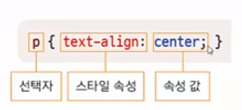
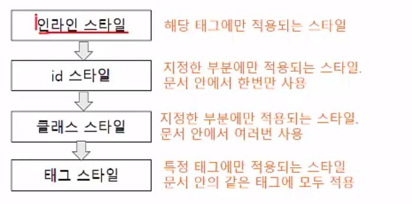
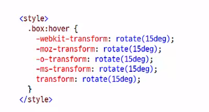
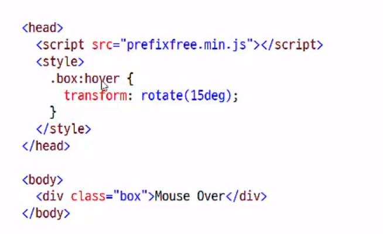

5 css 기초 및 주요 선택자
==========================
(1) 스타일과 스타일 시트
------------------------
* 스타일과 스타일 시트
    1. 스타일 : html 문서에서 자주 사용하는  글꼴이나 색상, 정렬, 각 요소들의 배치 방법 등 문서의 겉모습을 결정짓는 내용들
    2. 스타일 시트 : 스타일을 관리하기 쉽도록 한 군데 모아놓은 것
* 왜 스타일을 사용할까?
    1. 웹 문서의 내용과 상관없이 디자인만 바꿀 수 있다.
    2. 다양한 기기에 맞춰 탄력적으로 바뀌는 문서를 만들 수 있다.
* 스타일 형식
    - 
    - 선택자 : {} 사이에 정의한 스타일 규칙이 적용될 대상
    - 속성과 속성 값 : '속성 : 속성 값' 과 같은 형식으로 함께 표시하며, 속성/속성 값 쌍이 여럿일 경웨 세미콜론(;)으로 구분
* 주석
    - /* 와 */ 사이에 주석 내용
* 내부 스타일 시트
    - 웹 문서 안에서 사용할 스타일을 문서  안에 정리한 것
    - 모든 스타일 정보로 < head> 태그와 < /head> 태그 안에서 정의
    - < style> 태그와 < /style> 태그 사이에 작성
    - 
* 외부 스타일 시트
    - 여러 웹 문서에서 사용할 스타일을 별도 파일로 저장해 놓고 필요할 때마다 파일에서 가져와 사용
    - < style> 태그 없이 < link> 태그만 사용해 미리 만들어 놓은 외부 스타일 시트 파일 연결
    -
* 인라인 스타일
    - 스타일 시트는 아니고 스타일을 적용하고 싶은데 여러 곳, 반복해서 사용하는 것이 아니고 특정 부분 한 부분에서 사용하는 것이라서 인라인 스타일로 지정해 사용가능 
    - 
* * *
(2) 주요 선택자
----------------------------------------
* 전체 선택자
    - 페이지에 있는 모든 요소를 대상으로 스타일을 적용할 때 사용
    - ex)

          * {
              margin:0;
              padding:0;
          }
* 태그 선택자
    - 문서에서 특정 태그를 사용한 모든 요소에 스타일이 적용됨
    - ex)

          
          h2와 p 사용 한 모든 곳에 적용
* 클래스 선택자, id 선택자
    - 공통점: 요소의 특정 부분엠ㄴ 스타일 적용
    - 차이점
        1. 클래스 선택자 : 문서 안에서 여러 번 반복할 스타일이라면 클래스 선택자로 정의. 마침표(.) 다음에 클래스 이름 지정
        2. id 선택자 : 문서 안에서 한번만 사용한다면 id 선택자로 정의, 파운드(#) 다음에 id 이름 지정
        3. 
* 클래스 선택자
    - ex)
    
* id 선택자
    - ex) 
* 그룹 선택자
    - 같은 스타일을 사용하는 선택자를 한꺼번에 정의
    - ex) 
* * *
(3) 캐스 캐이딩 스타일 시트(css)
------------------------
* 캐스 캐이딩의 의미
    - '위에서 아래로 흐른다' 는 뜻
    - 선택자에 여러 스타일이 적용될 때 스타일 충돌을 막기 위해 '위에서 아래로 흐르며 적용되는' 방법을 선택
* 캐스캐이딩의 원칙
    1.  스타일 우선순위
    2. 스타일 상속 : 태그들의 포함 관계에 따라 부모 요소의 스타일을 자식 요소로, 위에서 아래로 전달.
* 원칙
    1. 원칙1 : 스타일 우선 순위
        1. 얼마나 중요한가에 따라
            - 
            - 스타일 시트 종류
                1. 사용자 스타일 시트 : 시스템에서 미리 만들어 놓음
                2. 제작자 스타일 시트 : 웹 사이트 만들 떼 제작자가 만듬
                3. 브라우저 스타일 시트 : 브라우저에 기본 글자 크기
                

        2. 얼마나 한정지을 수 있는가에 따라
            - 
    2. 원칙 2 : 스타일 상속
        - 자식 요소에서 별도로 스타일을 지정하지 않으면 부모 요소에 있는 스타일 속성들이 자식 요소로 전달됨.
        - 주의 할 것은 스타일의 모든 속성이 부모 요소에서 자식 요소로 상속되는 것은 아니다. (ex: 글자 색은 상속되지만 배경 색은 상속되지 않는다. 배경 색 배경 이미지 상속 안된다.)
* * *
(4) CSS3와 CSS 모듈
-----------------
* CSS란 
    - CSS1->CSS2->CSS3
    - css2를 기본으로 새로운 규약들을 추가한 것이 css3
    - css3 부터는 배경이나 글꼴, 박스 모델 등 수십 개 기능을 주제 별로 규약을 따로 만듬 -> "css 모듈" 이라고 부른다
* css3 와 브라우저 접두사
    - css3 모듈이 계속 개발되고 있는데 표준 규약이 아닌 속성들은 브라우저에 따라 다른 방식으로 지원됨
    -> 속성 이름 앞에 접두사(prefix)를 붙여 브라우저 별로 구분해야 한다.
    - 
    - 표준 규약이 완성된 속성도 옜날 버전의 모던 브라우저 사용자를 고려하기 위해 브라우저 접두사를 붙여 사용하기도 함 => 업그레이드 안한 브라우저 위해서
    - 접두사
        1. -webkit- : 웹키트 방식 브라우저(사파리, 크롬 등)
        2. -moz- : 게코 방식 (모질라, 파이어폭스 등)
        3. -o- : 오펠 브라우저
        4. -ms- : 마이크로소프트 인터넷 익스플로러
* 브라우저 접두사를 자동으로 붙여준다.
    - -preifix-free.js : 브라우저 벤더 접두사를 자동으로 붙여준다.
        1. http://leaverou.github.io/prefixfree/ 에서 파일 다운로드
        2. prefixfree.min.js 파일을 원하는 곳으로 복사하거나 옮김
        3. < script> 태그를 이용해 웹 문서에 삽입

            < script src="prefixfree.min.js">< /script>
        4. 이제부터는 브라우저 접두사 없이 css3 속성 사용
    - 

