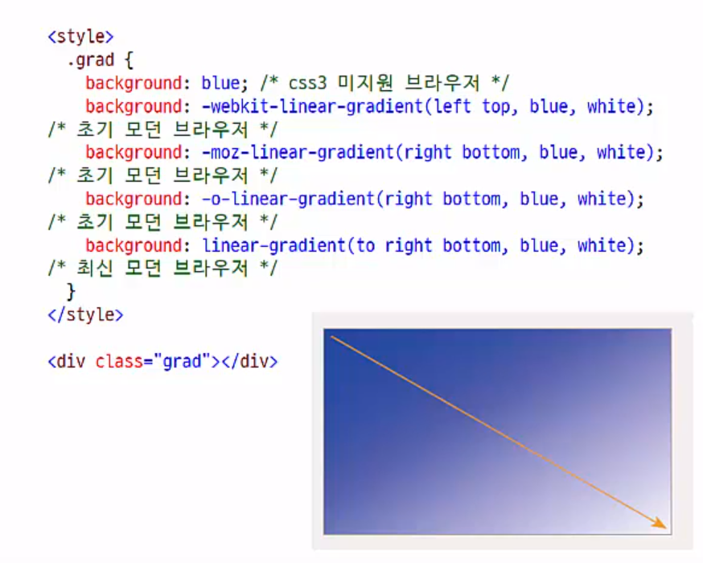
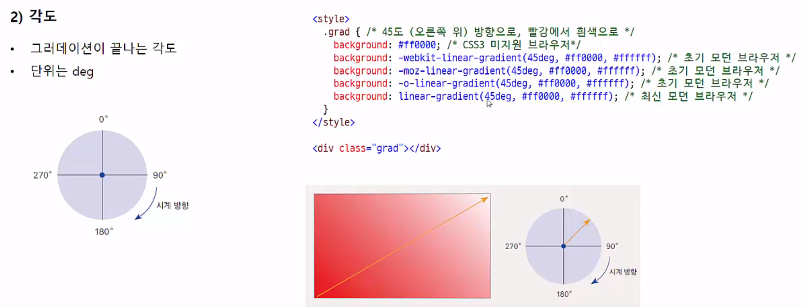
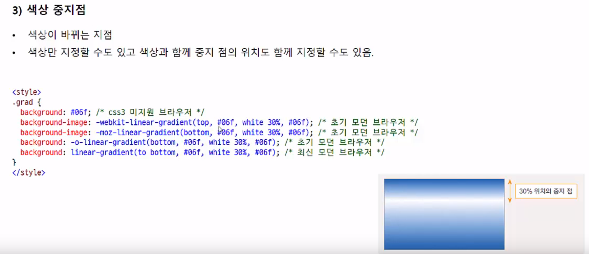
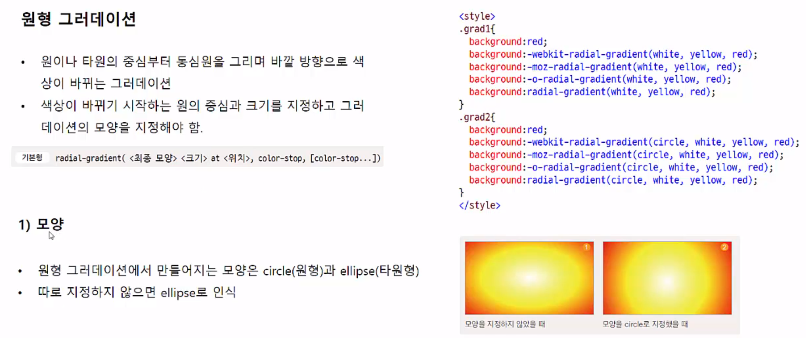
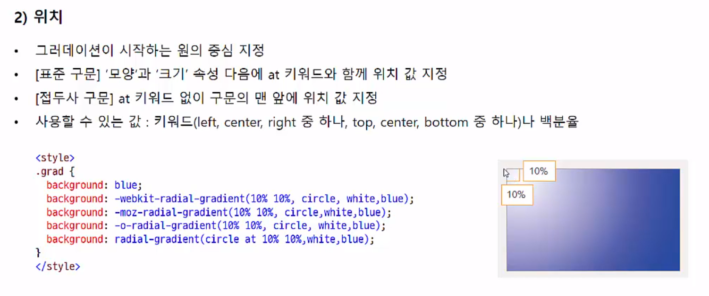
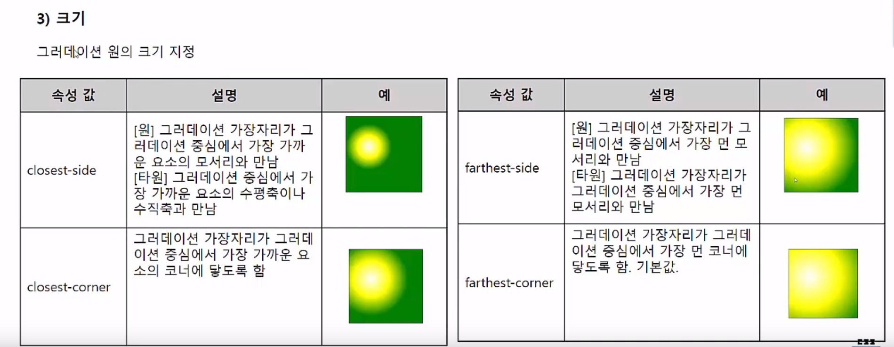

7 색상과 배경
=======================
**(1) 웹에서 색상 표현하기**
-----------------
* 웹에서 색상 표현하기
    1. 16진수 표기법
        -  -# ff(빨강)ff(초록)00(파랑) = 보라
    2. rgb/rgba 표기법
        - color:rgb(255,0,0) 처럼 세 자리의 숫자로 표시
        - 0~255
        - rgba : 투명도 조절
            - 0~1 값
            - 0 : 완전 투명
            - 1 : 불투명
    3. hsl/hsla 표기법
        - color:hsl(240,100%,50%) 처럼 세 자리의 숫자로 표사
        - 앞에서 부터 색상(hue), 채도(saturation), 밝기(light) 의 양
        - 투명도 조절할 때 마지막에 알파값 추가
    4. 색상 이름 표기법
        - 잘 알려진 색상 이름으로 표시
        - 기본 색상 16가지
        - 웹 안전 색상 : 모든 브라우저에서 표현 가능한 색상 
        - 216가지
* * *
**(2) 배경 색과 배경 이미지**
----------
* background-color 속성
    - 기본형

          background-color: <색상>
    - 웹 문서의 요소에 배경색 지정
    - ex) 웹 문서 전체에 지정하려면 body 요소에 사용.
    - 16진수나 rgb 값, rgba 값 또는 색상 이름 사용.
* background-clip 속성
    - 배경을 어디까지 적용할지 지정
    - 박스 모델 기준
    - 속성 값
        1. border-box : 박스 모델의 가장 외곽인 테두리(border)까지 적용
        2. padding-box : 박스 모델에서 테두리를 뺀 패딩 범위까지 적용
        3. content-bpx : 박스 모델에서 내용 부분에만 적용
* background-image 속성
    - 배경 이미지 지정
    - 배경 이미지 파일 경로 지정
    - 기본형

          background-image: url(파일경로)
    
* background-repeat 속성
    - 배경 이미지 반복 여부 및 반복 방향 지정
    - 속성
        1. repeat
        2. repeat-x : 브라우저 창 너비와 같아질 때까지 배경이미지 가로로 반복
        3. repeat-y : 브라우저 창 높이와 같아질 때까지 배경이미지 세로로 반복
        4. no-repeat : 배경 이미지 한 번만 표시하고 반복하지 않는다.
* background-size 속성
    - 배경 이미지 크기 조절
    - 속성 값
        1. auto : 원래 배경 이미지 크기만큼
        2. contain : 요소 안에 배경 이미지를 다 들어오도록 확대/축소
        3. cover : 배경 이미지로 요소를 모두 덮더록 확대/축소
        4. <크기 값> : 너비 값과 높이 값을 지정, 너비 값만 지정할 경우 원래 배경 이미지 기준으로 비율 계산해 자동 너비 지정
        5. <백분율> : 원래 배경 이미지를 기준으로 확대 축소
* background-position 속성
    - **배경 이미지를 반복하지 않을 경우**, 배경 이미지를 표시할 위치 지정
    - 기본형

          background-position:<수평 위치> <수직 위치>
    - 수평 위치: left|right||<백분율>|<길이 값>
    - 수직 위치: top|center|<백분율>|<길이 값>
* background-attachment 속성
    - 배경 이미지를 고정하는 속성
    - 스크롤 할 때 이미지가 따라다니게 화면 그자리에 고정되게
    - 기본형

          background-attachment: scroll|fixed
    - 속성
        1. scroll : 기본 값
        2. fixed : 화면 스크롤되더라도 화면에 고정됨
* background 속성
    - 그냥 다 갖다 박으면 된다.
    - 각 속성 값이 다르므로 표기 순서는 상관 없다.

* * *
**(3) 그라데이션 효과로 배경 꾸미기**
--------------------
* 그라데이션과 브라우저 접두사
    - 크기가 없는 배경 이미지이므로 background-image 에서 사용
    - 구형 모던 브라우저에서는 브라우저 접두사를 붙여야 동작함
        - -webkit-
        - -moz-
        - -o-
* 선형 그라데이션
    - 수직 방향이나 수평 방향으로, 혹은 대각선 방향으로 색상이 일정하게 변하는 것
    - 방향과 색상이 필요하다.
    - 기본형

          linear-gredient(<각도> to <방향>, color-stop,[color-stio])
    - 선형 그라데이션
        1. 방향
            - [표준 구문] 끝 지점을 기준으로 'to' 키워드와 함께 사용
            - 속성 값
                1. to top
                2. to left
                3. to right
                4. to bottom
            - ex)
        2. 각도
            - 
        3. 색상 중지점
            - 
* 원형 그라데이션
    1. 모양
        - 
    2. 위치
        - 
    3. 크기
        - 
    4. 색상중지점
        - 
    5. 그라데이션 반복
        - 

* * *
**(4) 이벤트 메일 만들기**
=====================