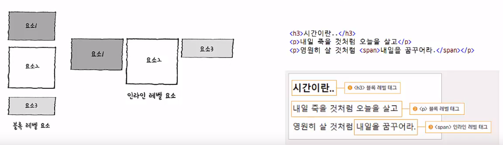
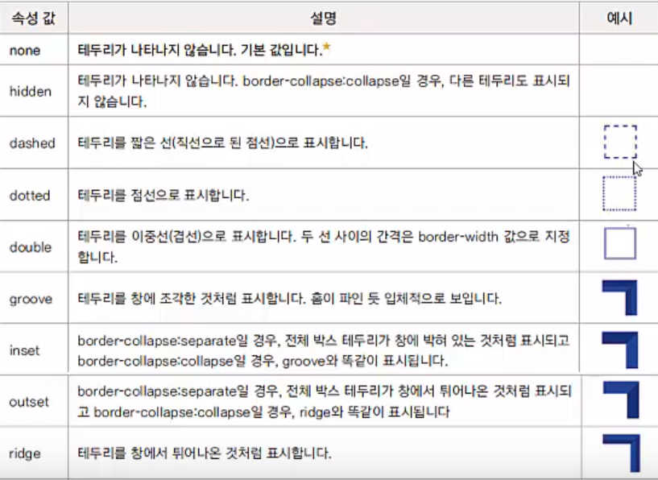
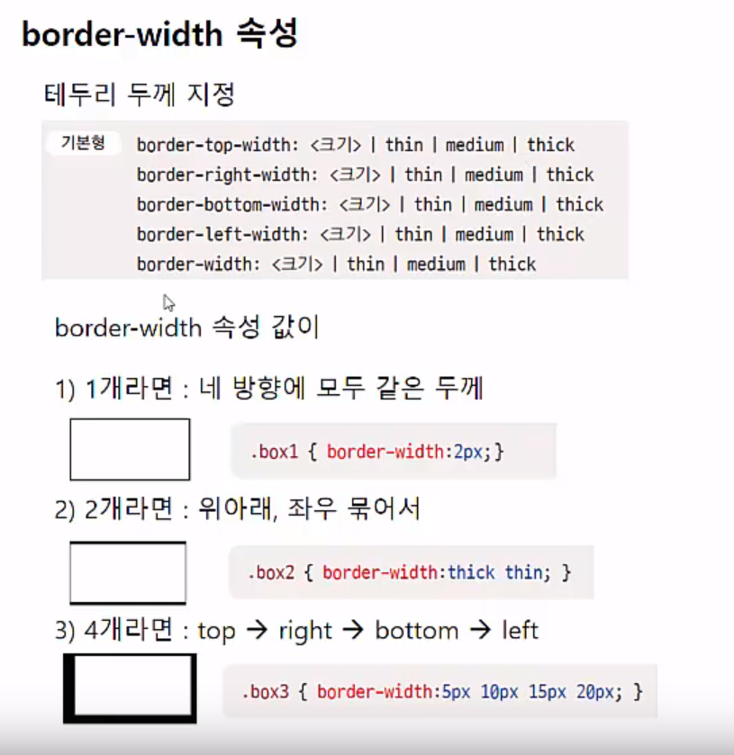
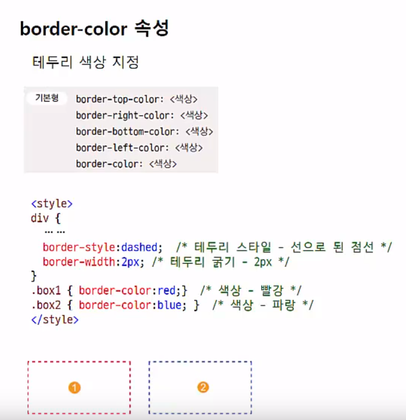
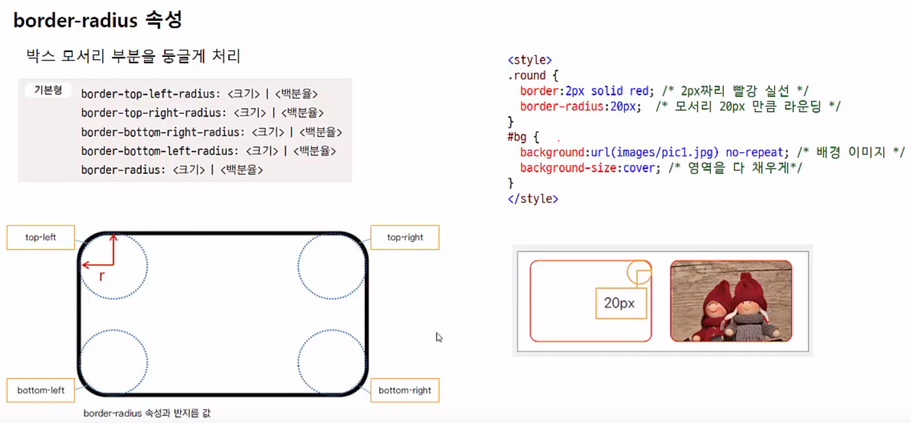
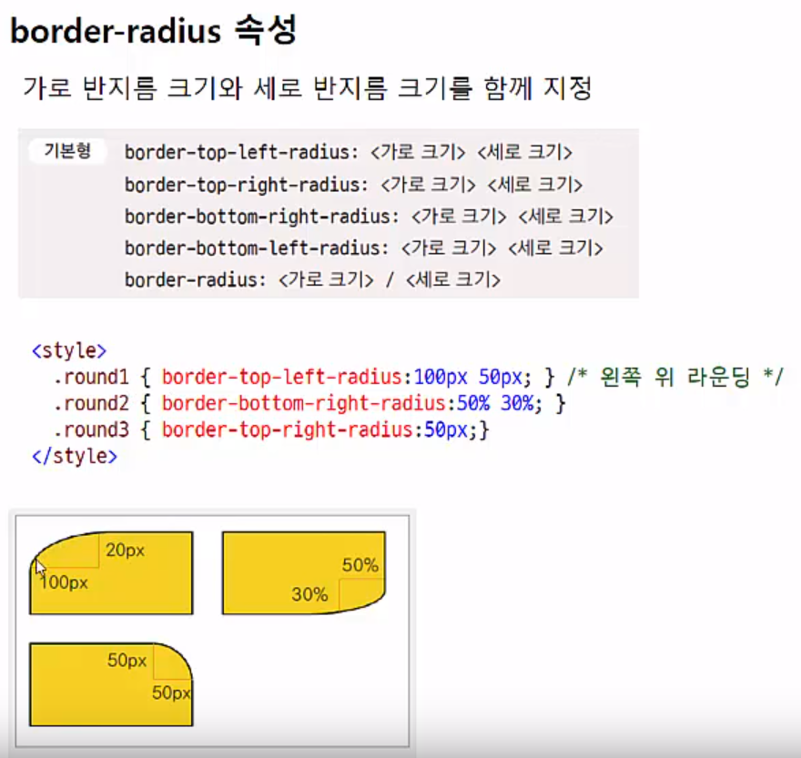
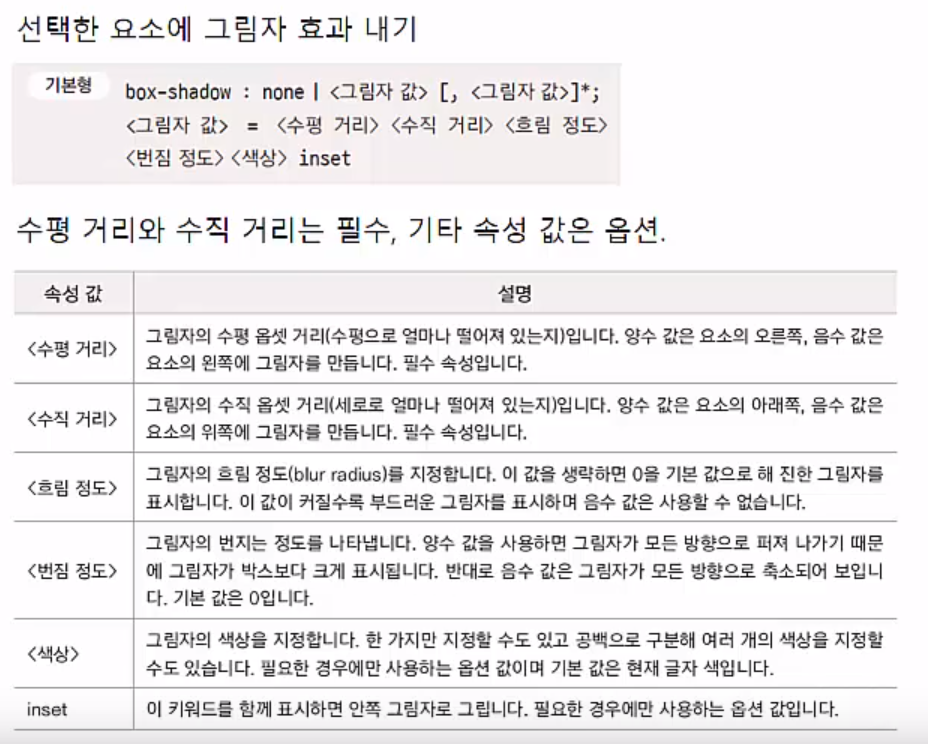
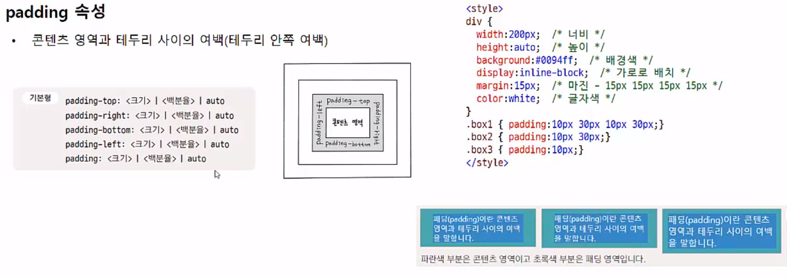
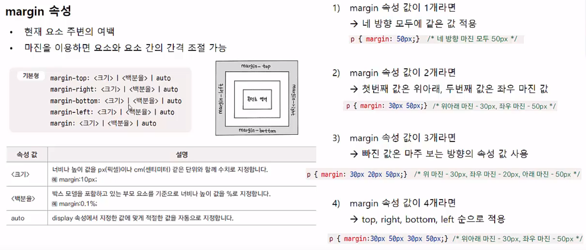

8 박스
=======================
**(1)CSS와 박스 모델**
---------------
* 요소
    1. 블록 레벨 요소
        - 요소를 삽입했을 때 혼자 한 줄으 차지하는 요소
        - 요소의 너비가 100%
        - < div>,< p> 등
    2. 인라인 레벨 요소
        - 줄을 차지하지 않는 요소
        - 화면에 표시되는 콘텐츠만큼만 영역을 차지하고 나머지 공간에는 다른 요소가 올 수 있다.
        - < img>,< strong> 등
    - 
* 박스 모델
    - 실제 콘텐츠 영역, 패딩(padding), 박스의 테두리(border), 그리고 마진(margin) 등의 요소로 구성됨
    - 패딩 : 곤텐츠 영역과 테두리 사이
    - 마진 : 요소와 요소 사이

* 박스 모델 속성
    - width, height 속성
        - 기본형

              width: <크기>|<백분율>|auto
              height: <크기>|<백분율>|auto
        - 속성 값
            1. 크기 : 너비나 높이 값을 px 이나 cm 단위의 수치로지정
            2. 백분율 : 박스 모델을 포함하는 부모 요소를 기준으로 너비나 높이 값을 지정
            3. auto : 컨텐츠 양에 따라 자동으로 결정됨
    - 실제 콘텐츠 너비 계산하기
        1. 모던 브라우저에서 박스 모델의 전체너비=width 값+좌우 패딩+ 좌우 테두리
        2. 인터넷 익스플로러6에서 박스 모델의 width 값=콘텐츠 너비 + 좌우패딩 + 좌우 테두리
* display 속성
    - 블록 레벨 요소를 인라인 레벨요소로 바꾼다
    - 인라인 레벨 요소를 블록 레벨요소로 바꾼다.
    - 기본형

          display: none|contents|block|inling|inline-block|table| table-cell
    - 속성 값
        1. display:block
            - 해당 요소를 블록 레벨로 지정
            - ex) < img> 를 세로로 나열되게
        2. display:inline
            - 해당 요소를 인라인 레벨로 지정
        3. display:inline-block
            - 요소를 인라인 레벨로 배치하면서 내용에는 블록 레벨 속성 지정
            - 배치는 인라인 안에서 속성 지정할 땐 블록으로
        4. display:none
            - 해당 요소를 화면에 표시하지 않음
            - 화면에서 공간도 차지하지 않음
            - 반응형 웹 만들 때
        5. 기타 display 속성 값
* * *
**(2) 테두리 관련 속성들**
--------------
* border-style 속성
    - 기본 값이 none -> 화면에 테두리 표시 안됨
    - 테두리 그리기 위해서 맨 먼저 테두리 스타일부터 지정
    - 속성 값
        1. none 
        2. solid : 실선
        3. hidden
        4. dashed : 짧은 선
        5. docted : 점선
        6. 
* border-width 속성
    - 
    - 3개면 빠진 left 는 마주보고 있는 값(right)으로 지정된다.
* border-color 속성
    - 
* border 속성
    - 한꺼번에 표시 가능
* border-radius 속성
    - 
    - 
* box-shadow 속성
    - 선택한 요소에 그림자 효과 내기
    - 

* * *
**(3) 여백을 조절하는 속성들**
-------
* padding 속성
    - 
* margin 속성
    - 