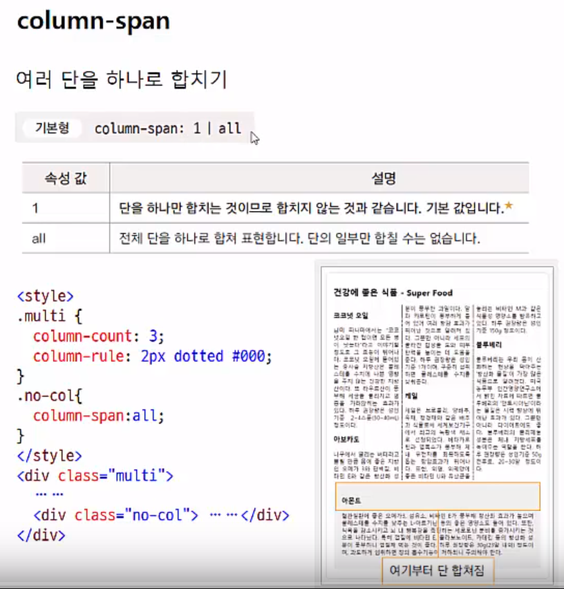
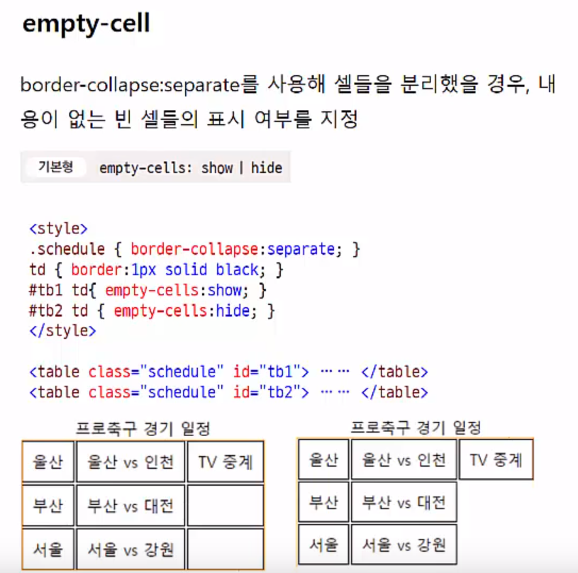
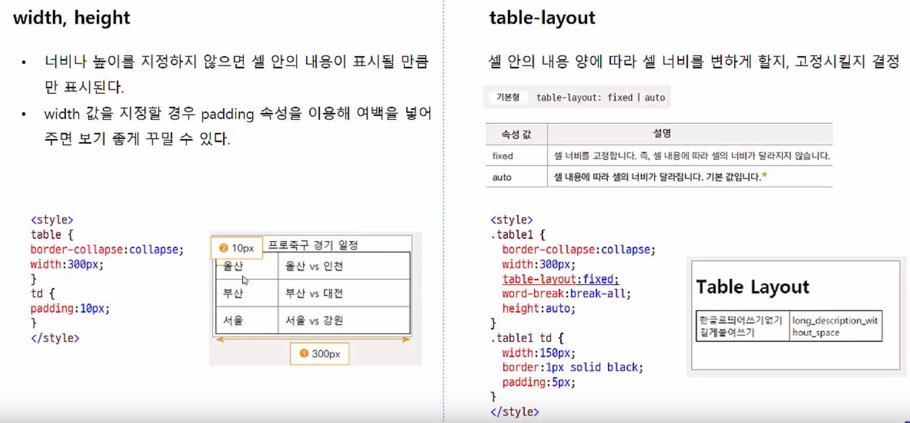

9 css 포지셔닝과 주요 속성들
=============
**(1) css 포지셔닝과 주요 속성들**
-----------
* css 포지셔닝 이란
    - css로 웹 문서 요소를 적절히 배치하는 것

* box-sizing 속성
    - 박스 모델의 너비 값 기준 지정
    - 기본형

          box-sizing:content-box|border-box
    - 속성 값
        1. content-box : width 속성 값을 콘텐츠 영역 너비 값으로 사용 (기본 값)
        2. border-box : width 속성 값을 테두리까지 포함한 박스 모델 전체 너비 값으로 사용
        - 

* float 속성
    - 요소를 왼쪽이나 오른쪽에 떠 있게 만듦
    - 기본형

          float:left|right|none
    - 속성
        - 
    - 왼쪽으로 가서 붙고 오른쪽으로 가서 붙는다.
* clear 속성
    - 

* **position 속성**
    - 웹 문서 안에 요소들을 배치하기 위한 속성
    - 기본형
    
          position: static|relative|absolute|fixed
    - 속성값
        1. static 
            - 문서의 흐름대로 배치
            - left 속성이나 top 속성을 지정할 수 없다.
            - 앞에 나온 소스 순서대로 차곡차곡 배열
            - 대신 좌표값 줘서 어느 위치 넣겠다는 못한다.
        2. relative
            - 자연 스럽게 배치
            - 고정되어 있지 않고 다른 요소에 의해 바뀔 수 있다.
            - 상대적인 위치를 사용하기 때문에 다른 요소와 조화를 이룬다.
            - left나 top 속성을 이용해 요소의 위치를 옮길 수도 있다.
            (static 과의 차이)
        3. absolute
            - 문서의 흐름과는 상관없이 원하는 위치에 요소를 배치
            - 요소의 위치는 가장 가까운 부모 요소나 조상 요소 중 position:relative 인 요소
            - left,top,right,bottom 속성을 사용해 네 모서리에서 얼마나 떨어져 있는지 지정
            - relative 요소 안에서 위치 지정 가능
            - 
        4. fixed
            - 문서의 흐름과는 상관없이 원하는 위치에 요소를 배치
            - 부모 요소가 아닌 브라우저 창 기준-> 브라우저 창 왼쪽 위 꼭지점(0,0) 기준으로 좌표 계산
            - 브라우저 창 화면을 스크롤하더라도 계속 같은 위치에 고정
            - 
* visibility 속성
    - 특정 요소를 화면에 보이거나 보이지 않게 설정하는 속성
    - 기본형

          visibility:visible|hidden|collapse
    - 속성
        1. visible : 화면에 요소 표시(기본값)
        2. hidden : 화면에서 요소를 감춤. 하지만 크기 그대로라서 배치에 영향을 준다. (display:none 은 아예 사라짐)
        3. clooapse : 표의 행, 열, 행 그룹, 열 그룹 등에서 지정하면 겹치도록 조정. 그 외의 영역에서 사용하면 'hidden' 처럼 처리
* z-index 속성
    - 요소 쌓는 순서 정하기
    - z-index 값이 크면 값이 작은 요소보다 위에 쌓인다.
    - z-index 값을 명시하지 않으면 1부터 시작해서 1씩 커진다.
    - 

* * *
**(2)다단으로 편집하기**
-----------
* column-width
    - 너비 고정해 놓고 단만들기
    - 화면 커지면 단의 개수 많아진다
    - 기본형

          column-width:<크기>|auto
* column-count
    - 단의 개수를 먼저 정해 놓고 화면 문할
    - 화면이 커질 수록 단의 너비가 넓어진다.
    - 기본형

          column-count:<숫자>|auto
* cloumn-rule
    - border 과 같다
    - border: 2px solid #ccc
* 다단 위치 지정
    - 
    - 

* * *
**(3) 표 스타일**
---------------
* caption-side
    - 캡션(설명글)은 기본적으로 표 위에 표시됨
    - 아래쪽에 표시 가능
    - 기본형

          caption-side:top|bottom
* border
    - 표의 바깥 테두리와 셀 테두리 모두 지정해야 함
    - 
* border-collapse
    - 표 테두리와 셀 테두리를 합칠 것인지 설정
    - 기본형

          border-collapse:collapse|separate(기본형)
    - 속성
        1. collapse : 테두리를 하나로 합쳐 표시
        2. separate : 테두리를 따로 표시 (기본 값)
    - 
    - 그냥 바깥 선 두줄로 할 지 한줄로 할지 아닌가??
* border-spacing
    - 
* empty-cell
    - 
* width,height, table layout
    - 
* cell 안에서 글자 정렬
    - 