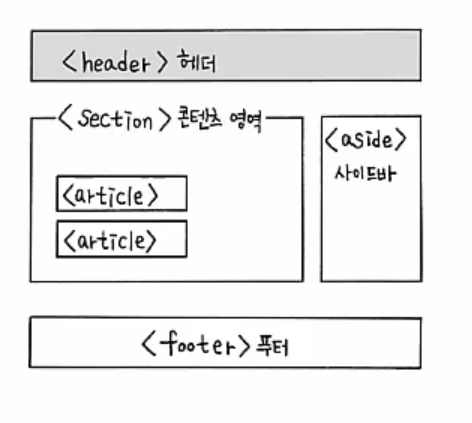
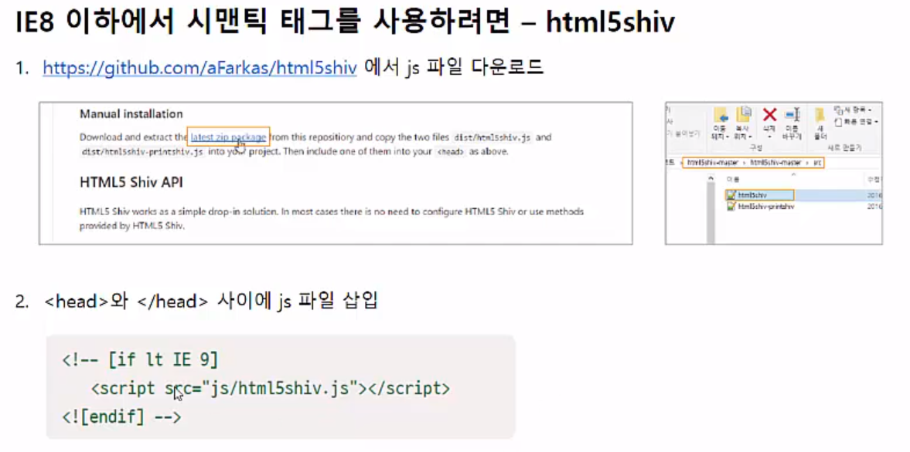

10 HTML5 시멘틱 태그
=======================
   
**(1) HTML5 시멘틱 태그**
-------------------
* HTML5 문서
    - 문서의 레이 아웃을 표준화
    - 
* < header> 태그- 머리말 지정하기
    - 사이트 전체의 제목 부분이 될 수도 있고, 본문의 제목 부분이 될 수도 있다.
    - 주로 페이지 맨 위쪽이나 왼쪽에 삽입
    - form 태그를 사용해 검색 창을 넣거나 < nav> 태그를 사용해 사이트 메뉴를 넣음
* < nav> 태그- 네비게이션 링크
    - 같은 사이트 안의 문서나 다른 사이트의 문서로 연결하는 링크를 나타냄
    - 내비게이션 메뉴뿐만 아니라 푸티에 있는 사이트 링크 모음 부분에도 사용됨
* < section> 태그 - 주제별 콘텐츠 영역
    - 문서에서 주제별로 콘텐츠를 묶을 때 사용
    - 섹션 제목을 나타내는 <hn> 태그가 함께 사용됨
* < article> 태그
    - 웹 상의 실제 내용 - 콘텐츠 내용
    - 태그 적용 부분을 떼어내 독립적으로 베포하거나 재사용하더라도 완전히 하나의 콘텐츠
* < aside> 태그 - 본문 이외의 내용
    - 본문 내용 외에 주변에 표시되는 기타 내용들
    - 필수 요소가 아니므로 광고나 링크 모음 등 문서의 메인 내용에 영향을 미치지 않는 내용들을 넣을 때 사용
* < iframe> 태그 - 외부 문서 삽입
    - 웹 문서 안에 다른 외부 문서 삽입 : 인라인 프레임
    - 광고 표시할 때 사용됨
    - 기본형

          <iframe src="삽입할 문서 주소" [속성="속성값"]></iframe>
    - 속성
* < footer> 태그 - 제작 정보와 저작권 정보
    - 사이트 제작자의 연락처 정보와 저작권 정보를 표시
* < address> 태그 - 제작자ㅇ 정보와 연락처 정보
    - 사이트 제작자의 이름이나 제작자의 웹 페이지 또는 피드백을 위한 연락처 정보
    - 웹 사이트와 관련된 우편 주소
    - (단순 우편 주소는 < p> 태그 사용)

* < div> 태그
    - 주로 콘텐츠를 묶어 시각적 효과를 적용할 때 즉 콘텐츠에 css를 적용할 때 사용한다.
* * *
(3) IE8 이하 버전에선 어떻게 하나
* 