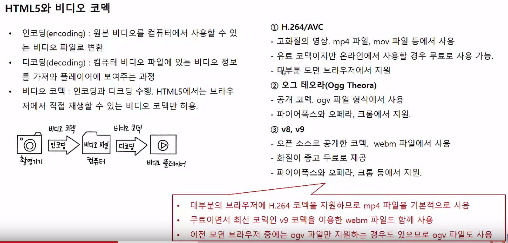
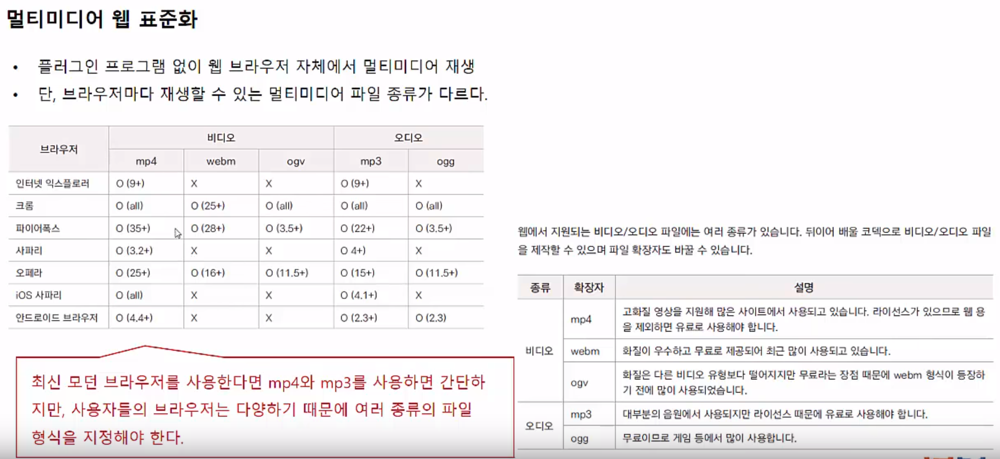
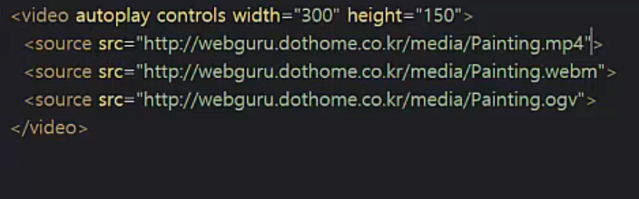
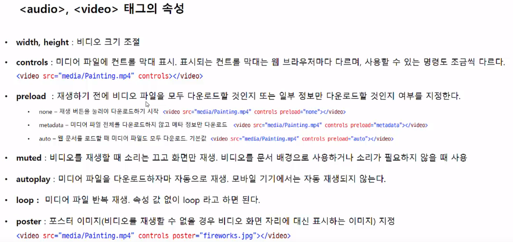
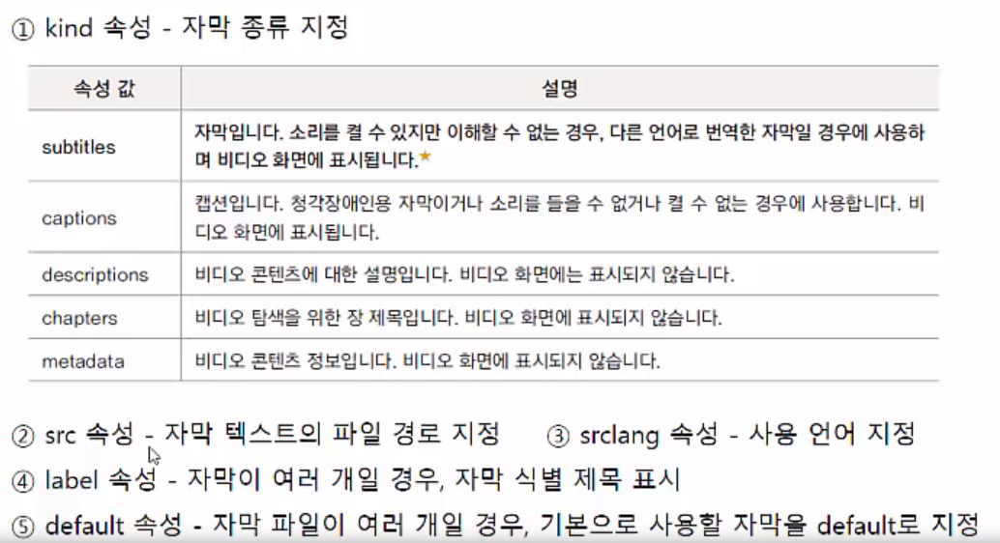
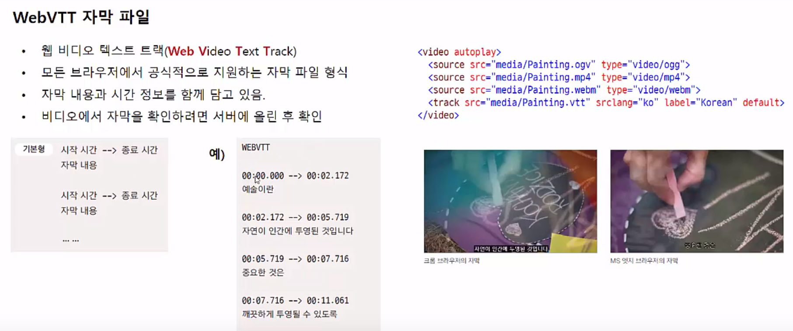

11 HTML5와 멀티미디어
================
**(1) 웹과 멀티미디어**
----------------
* 플러그인 프로그램
    - HTML4 까지는 웹 브라우저에서 멀티미디어를 직접 재생할 수 없기 때문에 플러그인 프로그램 연결해서 사용
    - HTML5 웹 표준 이후 웹 브라우저에서 직접 멀티미디어 재생
    - 유튜브나 비메오 등 비디오 사이트에서 HTML5 플레이어 사용
* < object>, < embed> - 외부 파일 삽입
    - 웹 브라우저에서 직접 재생할 수 없는 자바 애플릿이나 PDF, 플래시 무비 등 삽입
    - < object> 태그를 지원하지 않는 브라우저에서는 < embed> 태그 사용
    - object 기본형

          <object data="경로" type="유형" name="이름" width="너비" height="높이"></object>
    - embed 기본형

          <embed src="경로" type="유형" width="너비" height="높이">

* HTML5 와 비디오 코덱
    - 
    - mp4 기본적으로 사용
* 멀티미디어 웹 표준화
    - 
* HTML5 와 오디오 코덱
    1. NPEG-1 AUDIO Layer3(MP3 코덱)
        - 가장 많이 사용하는 오디오 코덱
        - mp3 파일에서 사용
        - 특허권이 등록되어 있어 유료
    2. 오그 보비스(Ogg Vorbis)
        - 공개 코덱 ogg 파일ㄹ 형식에서 사용
        - 재생 플레이어가 적고 인코딩 시간이 더 걸린다는 단점.
        -> but, 무료라서 PC 개암 등에 많이 사용됨 (사운드,이펙트)
        - 
* HTML5 비디오 변환
    - 스마트폰 등에서 찍은 동영상을 webm과 mp4, ogv 파일로 변환.
    - 인코딩 프로그램(인코더) 을 이용해 비디오 파일 형식 변환 ex) 카카오 인코더, 다음팟 인코더 등
    - 파이어 폭스 브라우저의 확장 프로그램 'firefogg' 을 이용해 webm 파일과 ogv 파일로 변환

* * *
   
**(2) 오디오 & 비디오 재생하기**
---------------
* < audio> 태그
    - 배경 음악이나 효과음 등 오디오 재생
    - 대부분 브라우저에서 mp3 지원하므로 mp3 파일만 사용
    - 기본형

          <audio src="오디오파일 경로" [속성] [속성="속성값"]>
    - 속성
        1. autoplay : 오디오를 자동 재생
        2. controls : 웹 화면에 컨트롤 막대를 표시한다. 컨트롤 막대에는 재생/멈춤, 진행 바, 볼륨 등이 표시된다.
        3. loop : 오디오를 반복 재생한다.
        4. muted : 오디오를 재생해 진행하지만 소리는 끈다.
        5. preload : 재생 버튼을 눌러 재생하기 전에 오디오 파일을 다운로드해 준비해 준다.
* < video> 태그
    - audio 태그와 똑같다.
    - 여러 파일 확장자로 틀기 위해서.. 
    
    - 

* * *
   
**(2) 오디오 & 비디오 재생하기**
----------------
* < track> 태그
    - 비디오에 외부 자막 파일을 연결하는 태그
    - 청각 장애인 뿐만 아니라 주변 소음이나 소리를 들을 수 없는 상황에서 비디오 내용을 이해하는데 도움이 됨
    - 기본형

          <track kind="자막 종류" src="경로" srclang="언어" label="제목" default>
    - 속성
        -  
* WebVTT 자막 파일
    -  
    - 비디오 캡션 메이커 사용해 자막만들기->비디오파일 웹상에 있어야 한다