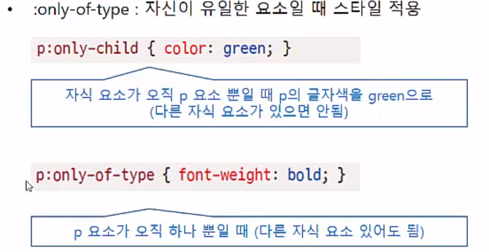

12 다재다능한 CSS3 셀렉터 
=======================
   
**(1) 연결 선택자**
---------------------
* 연결 선택자
    - 선택자와 선택자를 연결해 적용 대상을 한정하는 선택자
    - '컴비네이션 선택자(combination selector)' 또는 '조합 선태자' 라고도 함

* 하위 선택자
    - 기본형 

          상위요소 하위요소
    - 부모 요소에 포함된 모든 하위 요소에 스타일이 적용된다.
    - 자식 요소뿐만 아니라 손자 요소, 손자의 손자 요소 등 모든 하위 요소까지 적용
    - 하위 선택자를 정의할 때는 상위 요소와 하위 요소를 나란히 쓴다.
    - 

* 자식 선택자
    - 기본형

          부모요소 > 자식요소
    - 자식 요소에 스타일을 적용하는 선택자
    - 두 요소 사이에 > 를 표시해 부모 요소와 자식 요소를 구분
    - 
    - 하위 선택자와의 차이 : 하위 선택자는 하위에 있는 모든 그 요소에 적용이 된다.
* 인접 형제 선택자
    - 기본형

          요소1 + 요소2
    - 같은 부모를 가진 형제 요소 중 첫 번째 동생 요소에만 스타일 적용
    - 
* 형제 선택자
    - 기본형

          요소1 ~ 요소2
    -  

* * *
   
**(2) 속성 선택자**
---------------------

1. 
    * [속성] 선택자
        - 지정한 속성을 가진 요소를 찾아 스타일 적용
    * [속성=값] 선택자
        - 주어진 속성과 속성 값이 일치하는 요소를 찾아 스타일 적용
    * - 
2. 
    * [속성~= 값] 선택자
        - 여러 속성 값 중에 해당 값이 포함되어 있는 요소를 찾아 스타일 적용
        - 값이 들어있는 **<<단어>>** 가 있으면 된다.
        - 
        - button 단어만 있으면 된다.
    * [속성 |= 값] 선택자
        - 특정 값이 포함된 속성을 가진 요소를 찾아 스타일 적용
        - 하이폰으로 연결해 한 단어 값을 이루는 요소에도 적용
        - 값이 들어간 글자가 있으면 된다.
        - 
    * [속성 ^= 값] 선택자
        - 특정 값으로 시작하는 속성을 가진 요소를 찾아 스타일 적용
    * [속성 $= 값] 선택자
        - 특정 값으로 끝나는 속성을 가진 요소를 찾아 스타일 적용
    * - 
    * [속성 *= 값] 선택자
        - 값의 일부가 일치하는 속성을 가진 요소를 찾아 스타일 적용

* * *
   
**(3) 가상 클래스와 가상 요소**
---------------------
* 마크업 상에 표시 x
* 가상클래스
    * 사용자 동작에 반응하는 가상 클래스
        1. :link 
            - 방문하지 않은 리으에 스타일 적용
        2. :visited
            - 방문한 링크에 스타일 적용
        3. :active
            - 웹 요소를 활성화했을 때의 스타일 적용
        4. :hober
            - 웹 요소에 마우스 커서를 올려놓을 때의 스타일 적용
        5. :focus
            - 웹 요소에 초점이 맞추어졌을 때의 스타일 적용
        * 
        * link visited active hober 순서대로 써 줘야 한다.
    * UI 요소 상태에 따른 가상 클래스
        1. :enabled / :disabeld
            - 요소를 사용할 수 있을 때와 없을 때의 스타일 지정
        2. :checked
            - 라디오 박스나 체크 박스에서 항목을 선택했을 때의 스타일 지정
            - 
    * 구조 가상 클래스
        - :nth-child(n) 와 :nth-last-child(n)
            - 
            - ex) 짝수 번째 홀수 번째에 색깔 바꾸기
            - 그냥 자식 중 n 번째 꺼
        - :nth-of-type(n), :nth-last-of-type(n), :first-child, :last-child
            - 
            - nth of type 은 자식 중에 타입 중에 n 번째 꺼 
        * :first-of-type(n), :last-of-type(n)
            - :first-of-type(n) : 형제 요소들 중 첫번째 요소에 스타일 적용
            - :last-of-type(n) : 형제 요소들 중 마지막 요소에 스타일 적용
        * :only-child, :only-of-type
            - only-child : 부모 요소 안에 자식 요소가 유일하게 하나일 때 스타일 적용
            - only-of-type : 자신이 유일한 요소일 때 스타일 적용
            - 
    - 

* 가상 요소
    1. ::first-line : 특정 요소의 첫번째 줄에 스타일 적용
    2. ::first-letter : 특정 요소의 첫번째 글자에 스타일 적용
    3. ::before : 특정 요소의 앞에 지정한 내용을 추가
    4. ::after : 특정 요소의 뒤에 지정한 내용을 추가

    - 하지만 이 부분만 가져다가 자바스크립트로 처리하거나 이런건 불가능