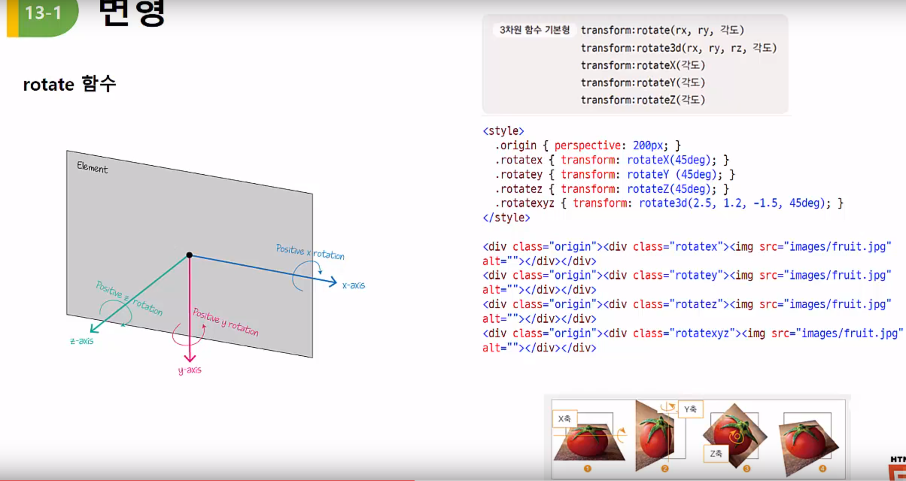

13 CSS변형 - 트랜스폼
=====================
 
**(1) 변형**
---------------
* 변형
    - 특정 요소의 크기나 형태 등 스타일이 바뀌는 것
    - 변형
        1. 2차원 변형
            - 수평이나 수직으로 웹 요소 변형
            - 크기나 각도만 지정하면 됨
            - 2차원 좌표 사용
        2. 3차원 변형
            - x 축과 y 축에 원근감 추가
            - z 축은 앞뒤로 이동, 보는 사람 쪽으로 다가올 수록 값이 더 커짐
* 
    1. translate 함수
        - 지정한 방향으로 이동할 거리를 지정하면 해당 요소를 이동시킴
        - 
    2. scale 함수
        - 지정한 크기만큼 확대나 축소
        - 
    3. rotate 함수
        - 각도만큼 웹 요소를 시계방향이나 시계 반대 방향으로 회전
        - 일반 각도(degree) 나 레디안(radian) 값 사용(180 래디안=1도)
        - 
        - 
        - rotate3D 는 4개의 인수가 필요한 듯 보인다.
        - rotate(x,y,z,a) 
    4. skew 함수
        - 
        - 
* * *
   
**(2) 변형과 관련된 속성들**
--------------
* origin 속성
    - 
* perspective 속성
    - 원래 원근감 없이 돌아가기만 하는데 원근감이 생긴다.
    - 하위 요소가 원근감이 생기게 만든다.
    - 
    - 
* transform-style 속성
    - 
    - flat : 하위 요소가 자신의 transform 하는 것을 막는다.
    - 3d : 부모 요소의 transform 의 상태에서 자식도 자신의 transform 한다.
* backface-visibility 속성
    - 요소의 뒷면, 즉 반대쪽 면을 표시할 것인지 결정
    - 

* * *
   
**(3) 트랜지션**
-----------
* 트랜지션이란
    - 웹 요소의 스타일 속성이 조금씩 자연스럽게 바뀌는 것
    - 트랜지션의 속성
        - 
* 트랜지션 속성
    1. transition-property 속성
        - 트랜지션을 적용할 속성 선택
        - 이 속성을 지정하지 않으면 모든 속성이 트랜지션 대상이 됨.
        - 
    2. transition-duration 속성
        - 트랜지션 진행 시간 지정
        - 시간 단위는 초 또는 밀리초
        - 트랜지션이 여러 개ㅐ라면 쉼표(,)로 구분해 진행 시간 지정
        - 
        - 너비는 2초동안 높이는 1초동안
    3. transition-timing-funtion 속성
        - 트랜지션의 시작과 중간, 끝에서의 속도 지정
        - 
    4. transition-delay 속성
        - 트랜지션이 언제부터 시작될지 지연 시간 지정
        - 시간 단위는 초(seconds) 또는 밀리초
        - 기본값 0
* * *
   
**(4) 애니메이션**
----------------
* css 와 애니메이션
    - 웹 요소에 애니메이션 추가
    - 애니메이션을 시작해 끝나는 동안 원하는 곳 어디서든 스타일을 바꾸며 애니메이션을 정의할 수 있다
    - 키프레임(keyframe) : 애니메이션 중간에 스타일이 바뀌는 지점
    - 주요 속성
        - 
    - 인터넷 익스플로 10이상과 최신 모던 브라우저에서 지원하며, 모던 브라우저 이전 버전을 고려하려면 -webkit-, -moz- 접두사를 붙여야 한다.
* 속성
    1. @keyframes 속성
        - 애니메이션의 시작과 끝을 비롯해 상태가 바뀌는 지점을 설정
        - '이름' 으로 애니메이션 구별
        - 기본형

              @keyframes <이름> {
                  <선택자> { <스타일> }
              }
        - 시작 위치는 0%, 끝 위치 100%로 놓고 위치 지정
        - 시작과 끝 위치만 사용한다면 from, to 키워드 사용 가능
        - @-webkit-keyframes나 @-moz-keyframes 처럼 브라우저 접두사를 붙여야함
        - 
        
    2. animation-name 속성
        - @keyframes 속성에서 만든 애니메이션 이름을 사용
        - 
    3. duration,direction,iteration-count,timing-funtion
        - 
    4. animation 속성
        - 여러 개의 애니메이션 속성을 하나의 속성으로 줄여서 사용
        - 지정하지 않은 기본 값 사용
        - 하지만 animation-name 과 animation-duration 속성 값은 지정해야 함.
        - 시간이 두 개 있다면 앞에 것은 duration 뒤에 것은 뒤에 것은 delay 시간이고 하나만 있다면 duration 이다.
        - 