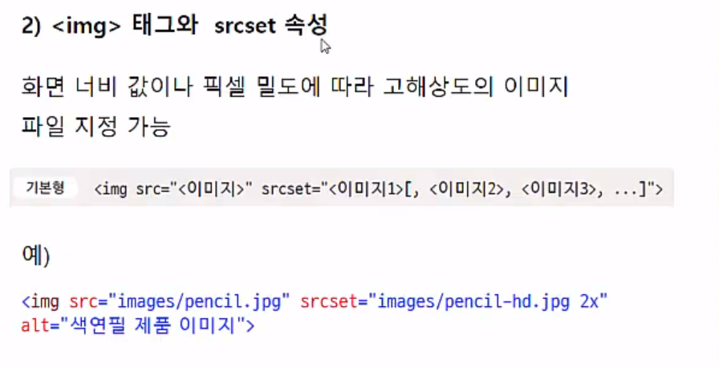
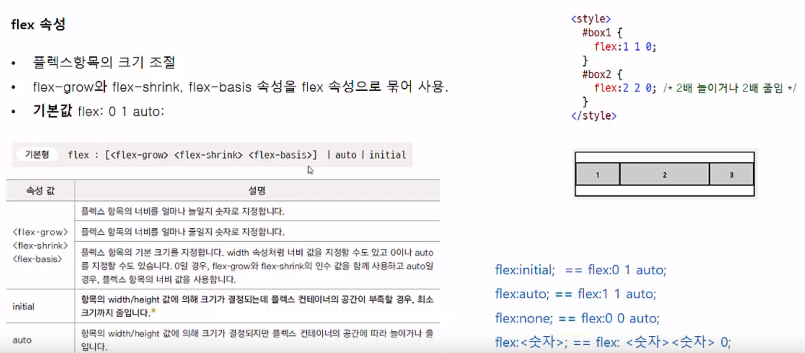

14 반응형 웹 디자인
====================
  
**(1) 모바일 기기와 웹 디자인**
-------------------
* 반응형 웹 디자인
    - 웹 사이트의 내용을 그대로 유지하면서 다양한 화면 크기에 맞게 웹 사이트를 표시하는 방법
    - 다양한 화면 크기의 모바일 기기들이 계속 쏟아져 나오는데 그 때마다 그 크기에 맞춘 사이트를 별도로 제작하는 것은 비효율적-> 화면 크기에 '반응'해 화면 요소들을 자동으로 바꾸어 사이트를 구현하는 것이 바로 반응형 웹 디자인
    - 장점
        1. 모든 스마트 기기에서 접속 가능
        2. 가로 모드에 맞춘 레이아웃 변경 가능
        3. 사이트 유지, 관리 용이
    - 단점
        1. 반응형 웹 기술이 최신 웹 표준인 CSS3의 일부 -> 최신 모던 웹 브라우저에서만 지원된다.
* 뷰포트
    - 뷰포트 : 실제 내용이 표시되는 영역
    - pc 화면과 모바일 화면의 픽셀 표시 방법이 다르기 때문에 모바일 화면에서 의도한댈 표시되지 않음 -> 뷰포트를 지정하면 기기화면에 맞춰 확대/축소 해서 내용 표시
    - 뷰포트 지정하기
        - < head> 태그 안에서 < meta> 태그를 이용해 뷰포트 지정
        - 기본형

              <meta name="viewport" content="<속성1=값>,<속성2=값>,...">
        - 일반적인 사용법 : 뷰포트의 너비를 스마트폰 화면 너비에 맞추고 초기 화면 배율을 1로 지정

              <meta name="viewport" content="width=divice-width,initial-scale=1">
        - 
* * *
   
**(2) 가변 그리드 레이아웃**
---------------
* 그리드 시스템 (grid system)
    - 화면을 여러 개의 칼럼(column) 으로 나누어, 필요할 때마다 칼럼들을 묶어 배치하는 방법
    - 
    - 양 옆에 패딩 값 10씩 있다
* 고정 그리드 레이아웃일 경우
    - 
    - width 값과 height 값을 고정시킨다.
    - 화면 크기를 줄이면 줄인 부분이 안보이게 된다.
* 가변 그리드 레이아웃 만들기
    - 
    - wrapper 96% 인 이유는 화면 좌우에 여유 두기 위해서
    - padding, margin 값도 %로 바꿔줘야 한다.
* * *
   
**(3) 가변 요소**
------------------
* 가변 글꼴
    - 
    - 1em=16px 가 아니라 배율 따짐
* 가변 이미지
    - 브라우저 창의 너비가 변하더라도 이미지 너비 값은 변하지 않음-> 브라우저 화면 너비를 줄일 경우 이미지 일부가 가려짐
    - 가변 이미지로 만들어 창의 너비에 따라 이미지 너비 조절시키기
    - 방법
        1. css를 이용한 방법
            - 
            - 하지만 이미지 파일 크기는 변함없이 크기 때문에 그다지 좋지는 않다
        2. < img> 태그와 srcset 속성 이용
            - 
            - 2x-> 픽셀 밀도가 2배인 화면(고해상도) 면 srcset 이미지로 표시 해라
        3. < picure>태그와 < source>태그
            - 
            - 
* 가변 비디오
    - 
* * *
   
**(4) 미디어 쿼리**
-------------
* 미디어 쿼리 구문
    - 기본형

          @media [only|not] 미디어 유형 [and 조건]*[and 조건]
    - 
* 미디어 쿼리 조건
    1. 웹 문서의 가로 너비와 세로 높이(뷰포트)
        - 
    2. 단말기의 가로 너비와 세로 높이
        - 
    3. 화면회전
        - 
    4. 화면 비율, 단말기 화면 비율, 색상당 비트 수
        - 

* 미디어 쿼리 중단점 만들기
    - 중단점 : 서로 다른 css 를 적용할 화면 크기
    - 대부분 기기의 화면 크기 기준
    - 모든 기기를 반영할 수 없기 때문에 스마트폰과 태블릿, 데스크톱 정도로 구분
    - 모바일 퍼스트 : 모바일 기기 레이아웃을 기본으로 작성-> 태블릿&PC 레이 아웃 작성
    - 미디어 쿼리 중단점은 개발자나 작업 조건에 따라 달라질 수 있다.
    - 

* * *
   
**(5) 미디어 쿼리 사용한 사이트 구성**
------------------
* 외부 css 파일 연결
    1. < link> 태그 사용하기
        - 
        - 연결해야할 css 태그가 많으면 이게 더 안정적
        - 자주쓰임
    2. @import 구문 사용하기
        - 
* 웹 문서에서 직접 정의하기
    1. < style> 태그 안에 media 속성 사용
        - 
        - 중단점 많을 경우 힘듬
    2. < style> 태그 안에 @media 구문 사용
        - 
        - 자주 쓰임

* * *
   
**(6) 플렉서블 박스 레이아웃**
--------------
* 

* 플렉서블 박스 레이아웃 기본 속성
    1. display 속성
        - 배치 요소들을 감싸는 부모 요소를 플렉스 컨테이너로 지정
        - 
        - display 속성과 브라우저 접두사
            - 최신 모던 브라우저에서는 모두 지원되고 대부분의 구식 버전에서도 지원됨
            - 하지만, 브라우저마다 플렉스 박스를 지원하는 방법이 달라 브라우저 접두사를 붙여야 한다.
            - 
    2. flex-direction 속성
        - 플렉스 항목 배치 방향 지정
        - 주축을 어디로 하고 어떤 방향으로 배치할지 결정
        - 기본형

              flex-direction:row|row-inverse|column|column-inverse
       
        - 속성 값
            - 
            - ex)
    3. flew-wrap 속성
        - 플렉스 항목을 한 줄 또는 여러 줄로 배치
        - wrap -> 주축 대로 채우다가 칸 부족하면 다음 줄
        - 
        - 
        - wrapreverse -> 주축 대로 채우다가 칸 부족하면 교차축 반대로
    4. flex-flow
        - 플렉스 배치 방향과 여러 줄 배치를 한꺼번에 지정
        - 기본 값은 flew-flow:row no-wrap
        - 기본형

              flew-flow: <플렉스 방향> <플렉스 폼 배치>
    5. order 속성
        - 

* 플렉스 항목 배치를 위한 속성 
    1. justify-content 속성 / align-items 속성, align-self 속성
        - 
    2. align-content 속성
        - 

* 플렉서블 박스 레이아웃 기본 속성
    1. flew 속성
        - 